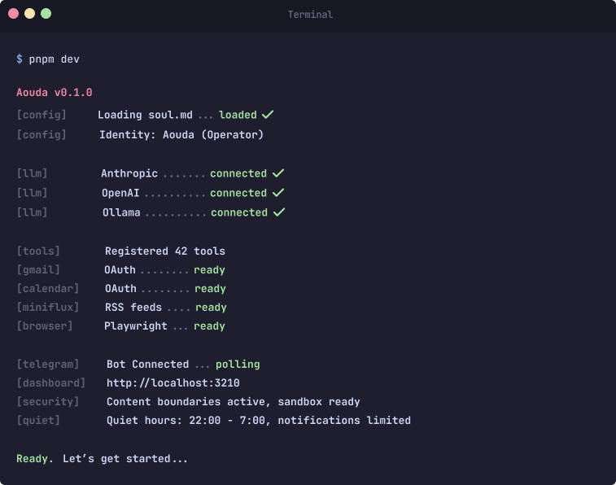
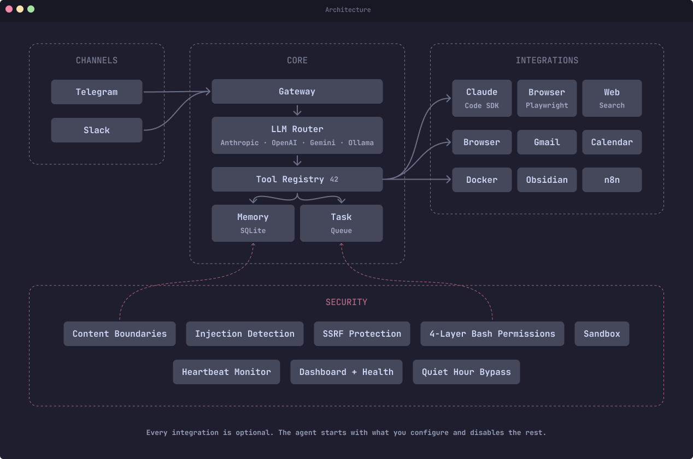

<div align="center">

# Aouda

**A security-first personal AI agent.** Single-user, self-hosted, 42 tools, 9,500 lines of TypeScript, 11 production dependencies, OWASP ASI-aligned. Telegram-native with Gmail, Calendar, browser automation, RSS, workflow orchestration, and Claude Code handoff -- all with human-in-the-loop approval.

[](#)
[](#)
[](SECURITY.md)
[](https://linkedin.com/in/rebeccaraebarton)
[](https://x.com/rebeccarae)
[](https://github.com/thatrebeccarae/aouda/stargazers)
[](LICENSE)
[](https://github.com/thatrebeccarae/aouda)

<br>

```bash
git clone https://github.com/thatrebeccarae/aouda.git
```

<br>



<br>
<br>

[Why Aouda](#why-i-built-aouda) · [Philosophy](#philosophy) · [Comparison](#how-aouda-compares) · [Architecture](#architecture) · [Features](#features) · [Quick Start](#quick-start) · [Security](#security) · [Contributing](CONTRIBUTING.md) · [Architecture Details](ARCHITECTURE.md)

</div>

---

## Why I Built Aouda

Most personal AI agents are either toys or liability. Toy projects answer questions and maybe send a Slack message. Framework agents hand an LLM unrestricted shell access, call it "autonomous," and hope for the best.

Aouda started after [OpenClaw](https://github.com/openclaw/openclaw) -- the most starred open-source agent framework -- shipped [8 CVEs in 60 days](https://www.securityweek.com/openclaw-security-issues-continue-as-secureclaw-open-source-tool-debuts/), a [supply chain attack](https://www.scworld.com/brief/massive-openclaw-supply-chain-attack-floods-openclaw-with-malicious-skills) hit 300,000 users through its skill marketplace, and a [Kaspersky audit](https://cybersecuritynews.com/openclaw-2026-2-12-released/) found 512 vulnerabilities in the codebase.

Aouda is an alternative -- same core functionality without the attack surface. Single-user, single-operator, 42 tools. Every external data path wrapped in content boundaries. Every shell command through a 4-layer permission system. Claude Code handoff with remote control sessions. Dangerous operations require human approval via Telegram. No remote skill loading, no marketplace, no multi-tenancy.

An active project and open-sourced as-is. Fork it, gut it, make it yours.

---

## Philosophy

**Security is architectural, not patchable.** You can't bolt security onto 430,000 lines of code with 49 dependencies and a remote skill marketplace. Aouda was built security-first from line one.

**Single-user is a feature.** Multi-tenant AI agents are an unsolved problem. When an agent has access to email, files, and shell commands, sharing context between users turns every prompt injection into a cross-tenant data breach. One operator, one trust boundary.

**Everything degrades gracefully.** No Gmail credentials? Gmail tools are disabled. No Docker? Sandbox falls back to the lightweight allow-list. No Miniflux? RSS features are skipped. The agent starts with whatever you configure and cleanly disables the rest.

**No remote skill loading.** Skills are local `.ts` files, tested and vetted and loaded at boot. No marketplace, no runtime downloads, no supply chain risk from community-contributed code.

**Human-in-the-loop by default.** Bash commands, Claude Code operations, and dangerous tool calls route to the operator for approval via Telegram. The agent asks before it acts.

**Multi-provider, not locked in.** Four LLM providers (Anthropic, OpenAI, Gemini, Ollama) with tier-based routing. Simple queries hit cheap models. Complex reasoning hits the best available. If a provider goes down, the router falls back automatically.

---

## How Aouda Compares

Different tools, different trade-offs. [OpenClaw](https://github.com/openclaw/openclaw) optimizes for breadth. [NanoClaw](https://github.com/qwibitai/nanoclaw) optimizes for container isolation. Aouda optimizes for minimal attack surface.

| | Aouda | OpenClaw | NanoClaw |
|---|---|---|---|
| **Lines of code** | 9,500 | 430,000+ | ~2,500 core |
| **Production dependencies** | 11 | 49 | ~15 |
| **Tools** | 42 | 25 built-in + marketplace | Claude Code's full toolset |
| **CVEs (lifetime)** | 0 | 8+ | 0 |
| **Remote skill loading** | No | Yes (ClawHub) | No |
| **LLM providers** | 4 (Anthropic, OpenAI, Gemini, Ollama) | 14 | 1 (Claude) |
| **Channels** | 2 (Telegram, Slack) | 14+ | 5 |
| **Content boundaries** | Yes (all external data paths) | No | No |
| **Injection detection** | Yes (pattern-based + heightened security mode) | No | No |
| **Sandbox** | 2-tier (lightweight + Docker) | Optional Docker | Mandatory container |
| **Proactive monitoring** | 5 monitors (inbox, Docker, calendar, heartbeat, RSS) | Via extensions | No |
| **Voice** | No | Yes | Yes (via Whisper) |
| **Mobile app** | No (Telegram) | Yes (iOS, Android) | No (Telegram) |
| **Community** | Solo build | 852 contributors, 247K stars | Solo build, 19K stars |

What's in the missing 420,500 lines? Attack surface.

---

## Architecture

<div align="center">

</div>

---

## Features

### Communication
- **Telegram** -- Primary interface with owner authentication and inline keyboard approvals
- **Slack** -- Optional channel with user allowlisting
- **Multi-provider LLM** -- Anthropic, OpenAI, Gemini, and local Ollama with automatic fallback

### Productivity
- **Gmail** -- Search, read, draft, archive, label (8 tools)
- **Google Calendar** -- List, create, update, delete events, find free time (7 tools)
- **Background tasks** -- Queue, schedule, and track long-running work
- **Claude Code handoff** -- Delegate coding tasks to a local Claude Code agent with Telegram-based approval for dangerous operations

### Research
- **Browser automation** -- Playwright-based navigation, screenshots, extraction, form filling, and page monitoring (5 tools)
- **RSS/Miniflux** -- Search, browse, and summarize feeds with scheduled morning digests (4 tools)
- **Web search** -- Multi-provider (Brave, SearXNG, DuckDuckGo) with automatic fallback

### Infrastructure
- **n8n workflows** -- List, trigger, and monitor workflow executions (3 tools)
- **Docker health monitoring** -- Proactive alerts when containers go down
- **Dashboard** -- Web UI with status overview, log viewer, and integrity checking
- **Heartbeat** -- Self-monitoring loop that detects anomalies and alerts the operator
- **Quiet hours** -- Configurable window to suppress non-urgent proactive notifications overnight (Docker-down and injection alerts bypass)
- **Remote control** -- Start a Claude Code remote session on your server and get a shareable link via Telegram

### Security
- **Content boundaries** -- All external data (email, web, RSS, calendar) is wrapped in security markers that prevent injection
- **Injection detection** -- Pattern-based detection with automatic heightened security mode
- **4-layer Bash permissions** -- Blocked patterns (auto-deny), heightened security (all to Telegram), safe prefixes (auto-approve), Telegram approval
- **SSRF protection** -- Fail-closed DNS validation for outbound requests
- **Sandbox** -- Docker-based and lightweight command execution with allowlists
- **OAuth token redaction** -- Credentials stripped from logs and LLM context

### Extensibility
- **Skills framework** -- Drop-in plugin system (`skills/` directory)
- **Configurable personality** -- `soul.md` defines voice, values, and behavior (see [Personality](#personality))
- **Vault integration** -- Read/write/search an Obsidian vault or any file tree

---

## Quick Start

```bash
git clone https://github.com/thatrebeccarae/aouda.git
cd aouda
pnpm install
cp .env.example .env        # add your API keys and Telegram bot token
cp config/soul.example.md config/soul.md   # customize personality
pnpm dev
```

**Requirements:**
- **macOS** -- developed and tested on macOS (Apple Silicon). Linux should work but is untested. Windows is not supported.
- Node.js >= 22
- pnpm
- A Telegram bot token ([BotFather](https://t.me/botfather))
- At least one LLM API key (Anthropic, OpenAI, or Gemini) -- or a running Ollama instance

The agent starts with only what you configure. No Gmail credentials? Gmail tools
are disabled. No Miniflux? RSS features are skipped. Everything degrades
gracefully.

> **Note:** A `pnpm setup` wizard is planned but not yet implemented. For now,
> edit `.env` manually.

---

## Configuration

All configuration is via environment variables. Copy `.env.example` and fill in
what you need.

### Required

| Variable | Description |
|---|---|
| `TELEGRAM_BOT_TOKEN` | Telegram bot token from BotFather |

At least one LLM provider is also required (or a running Ollama instance):

| Variable | Description |
|---|---|
| `ANTHROPIC_API_KEY` | Anthropic API key (Claude) |
| `OPENAI_API_KEY` | OpenAI API key |
| `GEMINI_API_KEY` | Google Gemini API key |

### Identity (optional)

| Variable | Default | Description |
|---|---|---|
| `OPERATOR_NAME` | `Operator` | Your name, used in prompts and messages |
| `PACKAGE_NAME` | `aouda` | Log prefix |
| `VAULT_BASE_PATH` | `~/agent-data` | Path to Obsidian vault or data directory |
| `CLAUDE_CODE_ALLOWED_PATHS` | `~/agent-data/Repos.nosync/,~/agent-data/02-Projects/` | Comma-separated paths Claude Code agent can access |

### Optional Integrations

| Variable | Default | Description |
|---|---|---|
| `TELEGRAM_ALLOWED_USERS` | *(none)* | Comma-separated Telegram user IDs to restrict access |
| `TELEGRAM_OWNER_CHAT_ID` | *(none)* | Owner's Telegram chat ID -- enables proactive monitoring, Claude Code handoff, heartbeat |
| `PORT` | `3210` | Health server and dashboard port |
| `OLLAMA_BASE_URL` | `http://127.0.0.1:11434` | Ollama API endpoint |
| `GOOGLE_CLIENT_ID` | *(none)* | Google OAuth client ID (Gmail + Calendar) |
| `GOOGLE_CLIENT_SECRET` | *(none)* | Google OAuth client secret |
| `GMAIL_REFRESH_TOKEN` | *(none)* | Gmail OAuth refresh token (see `.env.example` for setup steps) |
| `SLACK_BOT_TOKEN` | *(none)* | Slack bot token |
| `SLACK_APP_TOKEN` | *(none)* | Slack app-level token (for Socket Mode) |
| `SLACK_SIGNING_SECRET` | *(none)* | Slack signing secret |
| `SLACK_CHANNEL_ID` | *(none)* | Default Slack channel |
| `SLACK_ALLOWED_USERS` | *(none)* | Comma-separated Slack user IDs |
| `MINIFLUX_API_KEY` | *(none)* | Miniflux RSS reader API key |
| `MINIFLUX_URL` | `http://localhost:8080` | Miniflux instance URL |
| `N8N_API_KEY` | *(none)* | n8n workflow automation API key |
| `N8N_URL` | `http://localhost:5678` | n8n instance URL |
| `WEBHOOK_SECRET` | *(none)* | Secret for authenticating incoming webhook requests |

---

## Personality

Aouda uses a `soul.md` file to define the agent's personality, voice, values,
and behavioral boundaries. This file is loaded into the system prompt.

```bash
cp config/soul.example.md config/soul.md
```

The example file includes:

- **Voice** -- Tone, verbosity preferences, formatting rules
- **Values** -- Priority-ordered value hierarchy (safety > mission > honesty > autonomy > efficiency)
- **Boundaries** -- Hard limits on credential exposure, infrastructure disclosure, destructive actions
- **Tool behavior** -- Rules about how to use tools (summarize, don't dump raw data)
- **Anti-patterns** -- Explicitly banned behaviors (sycophancy, filler, emotional performance)

Edit `soul.md` to match your preferences. The agent's personality is entirely
defined here -- there's no hardcoded persona in the source code.

---

## Security

Defense-in-depth, informed by the [OWASP Top 10 for Agentic Applications (2026)](https://genai.owasp.org/resource/owasp-top-10-for-agentic-applications-for-2026/) -- 8 of 10 categories fully mitigated, 2 partial.

- **Content boundaries** -- Every external data path (email, web, RSS, calendar, webhooks) wrapped in security markers before it reaches the LLM
- **Injection detection** -- Pattern matching with heightened security mode (30 min of manual approval for all Bash commands)
- **4-layer Bash permissions** -- Blocked → heightened → safe prefixes → Telegram approval
- **2-tier sandbox** -- Lightweight allow-list + Docker (`--network none`, `--cap-drop ALL`)
- **SSRF protection** -- Fail-closed DNS validation, private IP blocking, DNS rebinding defense
- **Single-user model** -- One operator, one trust boundary, no multi-tenancy

See `SECURITY.md` for the full threat model and mitigation details.

---

## Optional Integrations

Each integration is independently optional. The agent starts with whatever is
configured and cleanly disables the rest.

| Integration | Requires | Provides |
|---|---|---|
| **Gmail** | Google OAuth credentials + refresh token | Inbox search, read, draft, archive, label |
| **Google Calendar** | Google OAuth credentials + refresh token | Event CRUD, free time search |
| **Slack** | Slack bot + app tokens | Two-way messaging channel |
| **Browser** | `playwright-chromium` (optional dep) | Page navigation, screenshots, extraction, form fill |
| **Miniflux** | Self-hosted Miniflux + API key | RSS search, feed browsing, morning digest |
| **n8n** | Self-hosted n8n + API key | Workflow listing, triggering, execution monitoring |
| **Claude Code** | Anthropic API key + `TELEGRAM_OWNER_CHAT_ID` | Autonomous coding with human-in-the-loop approval |
| **Docker monitoring** | Docker socket access + `TELEGRAM_OWNER_CHAT_ID` | Container health alerts |
| **Ollama** | Running Ollama instance | Local LLM inference (no API key needed) |

---

## Project Structure

```
src/
  index.ts              # Bootstrap and wiring
  agent/                # Core loop, system prompt, tool registry
  llm/                  # Multi-provider LLM router (Anthropic, OpenAI, Gemini, Ollama)
  channels/             # Telegram, Slack adapters
  gateway/              # Message routing, health server
  memory/               # SQLite-backed conversation memory + semantic search
  tasks/                # Background task queue, worker, scheduler
  security/             # Content boundaries, injection detection
  sandbox/              # Docker + lightweight command execution
  dashboard/            # Web UI, API, log buffer, integrity checker
  heartbeat/            # Proactive self-monitoring
  gmail/                # Gmail tools
  calendar/             # Google Calendar tools
  google/               # Shared Google OAuth utilities
  browser/              # Playwright automation + agent-browser
  miniflux/             # Miniflux RSS tools + morning digest
  n8n/                  # n8n workflow tools
  claude-code/          # Claude Code SDK executor + approval manager
  skills/               # Plugin framework + loader
  config/               # Identity constants
config/
  soul.example.md       # Personality template
skills/                 # Drop-in skill plugins
```

---

## Contributing

See `CONTRIBUTING.md`.

---

## License

MIT
