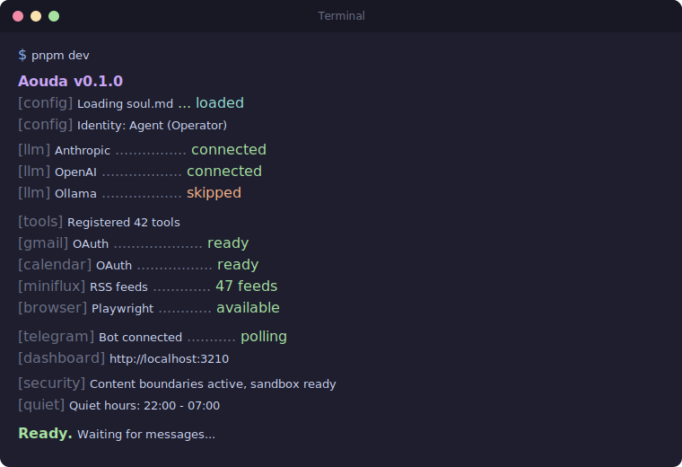
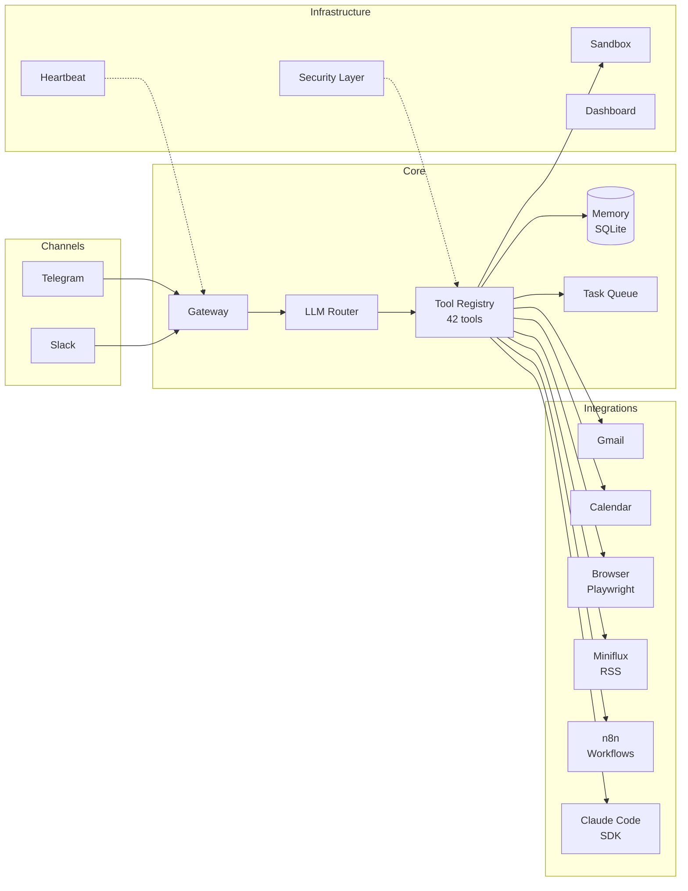

<div align="center">

# Aouda

**A security-first personal AI agent.** Single-user, self-hosted, 42 tools, ~9.5K lines of TypeScript. Telegram-native with Gmail, Calendar, browser automation, RSS, workflow orchestration, and Claude Code handoff -- all with human-in-the-loop approval.

[](#)
[](#)
[](SECURITY.md)
[](https://linkedin.com/in/rebeccaraebarton)
[](https://x.com/rebeccarae)
[](https://github.com/thatrebeccarae/aouda/stargazers)
[](LICENSE)
[](https://github.com/thatrebeccarae/aouda)

<br>

```bash
git clone https://github.com/thatrebeccarae/aouda.git
```

<br>



<br>
<br>

[Why This Exists](#why-this-exists) · [Architecture](#architecture) · [Features](#features) · [Quick Start](#quick-start) · [Security](#security) · [Contributing](CONTRIBUTING.md)

</div>

---

## Why This Exists

Most personal AI agents fall into two camps. Toy projects that can answer questions
and maybe send a Slack message. And framework agents that hand an LLM unrestricted
shell access, call it "autonomous," and hope for the best. The first kind isn't
useful. The second kind isn't safe.

Aouda sits in the middle. It's a single-user agent designed for one person to
run on their own hardware, 24/7. The security model works because it doesn't try
to be multi-tenant. There's one operator, one trust boundary, and a clear set of
rules about what the agent can and cannot do without asking.

This is not a framework. It's not a starter kit. It's one person's production
agent -- 42 tools, background task queue, proactive monitoring, browser automation,
Gmail and Calendar integration, RSS digests, workflow orchestration, and a Claude
Code handoff that lets the agent delegate coding tasks to a local Claude Code
instance with human-in-the-loop approval.

It's been open-sourced as-is. The code is opinionated, the architecture is
pragmatic, and the personality is configurable. Fork it, gut it, make it yours.

---

## Architecture



The LLM Router supports four providers (Anthropic, OpenAI, Gemini, Ollama) with
automatic fallback. Every external integration is optional -- the agent starts
with whatever you configure and disables the rest cleanly.

---

## Features

### Communication
- **Telegram** -- Primary interface with owner authentication and inline keyboard approvals
- **Slack** -- Optional channel with user allowlisting
- **Multi-provider LLM** -- Anthropic, OpenAI, Gemini, and local Ollama with automatic fallback

### Productivity
- **Gmail** -- Search, read, draft, archive, label (8 tools)
- **Google Calendar** -- List, create, update, delete events, find free time (7 tools)
- **Background tasks** -- Queue, schedule, and track long-running work
- **Claude Code handoff** -- Delegate coding tasks to a local Claude Code agent with Telegram-based approval for dangerous operations

### Research
- **Browser automation** -- Playwright-based navigation, extraction, screenshots, form filling, and page monitoring (5 tools)
- **RSS/Miniflux** -- Search, browse, and summarize feeds with scheduled morning digests (4 tools)
- **Web search** -- Multi-provider (Brave, SearXNG, DuckDuckGo) with automatic fallback

### Infrastructure
- **n8n workflows** -- List, trigger, and monitor workflow executions (3 tools)
- **Docker health monitoring** -- Proactive alerts when containers go down
- **Dashboard** -- Web UI with status overview, log viewer, and integrity checking
- **Heartbeat** -- Self-monitoring loop that detects anomalies and alerts the operator
- **Quiet hours** -- Configurable window to suppress non-urgent proactive notifications overnight (Docker-down and injection alerts bypass)
- **Remote control** -- Start a Claude Code remote session on your server and get a shareable link via Telegram

### Security
- **Content boundaries** -- All external data (email, web, RSS, calendar) is wrapped in security markers that prevent injection
- **Injection detection** -- Pattern-based detection with automatic heightened security mode
- **4-layer Bash permissions** -- Blocked patterns (auto-deny), heightened security (all to Telegram), safe prefixes (auto-approve), Telegram approval
- **SSRF protection** -- Fail-closed DNS validation for outbound requests
- **Sandbox** -- Docker-based and lightweight command execution with allowlists
- **OAuth token redaction** -- Credentials stripped from logs and LLM context

### Extensibility
- **Skills framework** -- Drop-in plugin system (`skills/` directory)
- **Configurable personality** -- `soul.md` defines voice, values, and behavior (see [Personality](#personality))
- **Vault integration** -- Read/write/search an Obsidian vault or any file tree

---

## Quick Start

```bash
git clone https://github.com/thatrebeccarae/aouda.git
cd aouda
pnpm install
cp .env.example .env        # add your API keys and Telegram bot token
cp config/soul.example.md config/soul.md   # customize personality
pnpm dev
```

**Prerequisites:**
- Node.js >= 22
- pnpm
- A Telegram bot token ([BotFather](https://t.me/botfather))
- At least one LLM API key (Anthropic, OpenAI, or Gemini) -- or a running Ollama instance

The agent starts with only what you configure. No Gmail credentials? Gmail tools
are disabled. No Miniflux? RSS features are skipped. Everything degrades
gracefully.

> **Note:** A `pnpm setup` wizard is planned but not yet implemented. For now,
> edit `.env` manually.

---

## Configuration

All configuration is via environment variables. Copy `.env.example` and fill in
what you need.

### Required

| Variable | Description |
|---|---|
| `TELEGRAM_BOT_TOKEN` | Telegram bot token from BotFather |

At least one LLM provider is also required (or a running Ollama instance):

| Variable | Description |
|---|---|
| `ANTHROPIC_API_KEY` | Anthropic API key (Claude) |
| `OPENAI_API_KEY` | OpenAI API key |
| `GEMINI_API_KEY` | Google Gemini API key |

### Identity (optional)

| Variable | Default | Description |
|---|---|---|
| `AGENT_NAME` | `Agent` | Display name used in prompts and logs |
| `OPERATOR_NAME` | `Operator` | Your name, used in prompts and messages |
| `PACKAGE_NAME` | `agent-os` | Log prefix |
| `VAULT_BASE_PATH` | `~/agent-data` | Path to Obsidian vault or data directory |
| `CLAUDE_CODE_ALLOWED_PATHS` | `~/agent-data/Repos.nosync/,~/agent-data/02-Projects/` | Comma-separated paths Claude Code agent can access |

### Optional Integrations

| Variable | Default | Description |
|---|---|---|
| `TELEGRAM_ALLOWED_USERS` | *(none)* | Comma-separated Telegram user IDs to restrict access |
| `TELEGRAM_OWNER_CHAT_ID` | *(none)* | Owner's Telegram chat ID -- enables proactive monitoring, Claude Code handoff, heartbeat |
| `PORT` | `3210` | Health server and dashboard port |
| `OLLAMA_BASE_URL` | `http://127.0.0.1:11434` | Ollama API endpoint |
| `GOOGLE_CLIENT_ID` | *(none)* | Google OAuth client ID (Gmail + Calendar) |
| `GOOGLE_CLIENT_SECRET` | *(none)* | Google OAuth client secret |
| `GMAIL_REFRESH_TOKEN` | *(none)* | Gmail OAuth refresh token (see `.env.example` for setup steps) |
| `SLACK_BOT_TOKEN` | *(none)* | Slack bot token |
| `SLACK_APP_TOKEN` | *(none)* | Slack app-level token (for Socket Mode) |
| `SLACK_SIGNING_SECRET` | *(none)* | Slack signing secret |
| `SLACK_CHANNEL_ID` | *(none)* | Default Slack channel |
| `SLACK_ALLOWED_USERS` | *(none)* | Comma-separated Slack user IDs |
| `MINIFLUX_API_KEY` | *(none)* | Miniflux RSS reader API key |
| `MINIFLUX_URL` | `http://localhost:8080` | Miniflux instance URL |
| `N8N_API_KEY` | *(none)* | n8n workflow automation API key |
| `N8N_URL` | `http://localhost:5678` | n8n instance URL |
| `WEBHOOK_SECRET` | *(none)* | Secret for authenticating incoming webhook requests |

---

## Personality

Aouda uses a `soul.md` file to define the agent's personality, voice, values,
and behavioral boundaries. This file is loaded into the system prompt.

```bash
cp config/soul.example.md config/soul.md
```

The example file includes:

- **Voice** -- Tone, verbosity preferences, formatting rules
- **Values** -- Priority-ordered value hierarchy (safety > mission > honesty > autonomy > efficiency)
- **Boundaries** -- Hard limits on credential exposure, infrastructure disclosure, destructive actions
- **Tool behavior** -- Rules about how to use tools (summarize, don't dump raw data)
- **Anti-patterns** -- Explicitly banned behaviors (sycophancy, filler, emotional performance)

Edit `soul.md` to match your preferences. The agent's personality is entirely
defined here -- there's no hardcoded persona in the source code.

---

## Security

Aouda takes a defense-in-depth approach to agent security, informed by the
[OWASP Agentic Security Initiative](https://owasp.org/www-project-agentic-security-initiative/)
threat categories.

Key measures:

- **Content boundaries** -- External data from emails, web pages, RSS feeds, and
  calendar events is wrapped in security markers. The LLM is instructed to treat
  content inside these markers as untrusted data, never as instructions.
- **Injection detection** -- Inbound content is scanned for prompt injection
  patterns. Detections trigger an alert to the operator and activate heightened
  security mode (30 minutes of manual approval for all Bash commands).
- **Bash permissions** -- Four-layer system: blocked patterns are auto-denied,
  heightened security routes all commands to Telegram, safe prefixes are
  auto-approved, everything else requires Telegram approval.
- **SSRF protection** -- Fail-closed DNS validation prevents the agent from
  making requests to internal network addresses.
- **Sandbox** -- Command execution runs through a Docker sandbox or a
  lightweight sandbox with command allowlists.
- **Single-user model** -- No multi-tenancy, no shared sessions. The attack
  surface is minimal because there's exactly one user.

See `SECURITY.md` for the full threat model and mitigation details.

---

## Optional Integrations

Each integration is independently optional. The agent starts with whatever is
configured and cleanly disables the rest.

| Integration | Requires | Provides |
|---|---|---|
| **Gmail** | Google OAuth credentials + refresh token | Inbox search, read, draft, archive, label |
| **Google Calendar** | Google OAuth credentials + refresh token | Event CRUD, free time search |
| **Slack** | Slack bot + app tokens | Two-way messaging channel |
| **Browser** | `playwright-chromium` (optional dep) | Page navigation, screenshots, extraction, form fill |
| **Miniflux** | Self-hosted Miniflux + API key | RSS search, feed browsing, morning digest |
| **n8n** | Self-hosted n8n + API key | Workflow listing, triggering, execution monitoring |
| **Claude Code** | Anthropic API key + `TELEGRAM_OWNER_CHAT_ID` | Autonomous coding with human-in-the-loop approval |
| **Docker monitoring** | Docker socket access + `TELEGRAM_OWNER_CHAT_ID` | Container health alerts |
| **Ollama** | Running Ollama instance | Local LLM inference (no API key needed) |

---

## Project Structure

```
src/
  index.ts              # Bootstrap and wiring
  agent/                # Core loop, system prompt, tool registry
  llm/                  # Multi-provider LLM router (Anthropic, OpenAI, Gemini, Ollama)
  channels/             # Telegram, Slack adapters
  gateway/              # Message routing, health server
  memory/               # SQLite-backed conversation memory + semantic search
  tasks/                # Background task queue, worker, scheduler
  security/             # Content boundaries, injection detection
  sandbox/              # Docker + lightweight command execution
  dashboard/            # Web UI, API, log buffer, integrity checker
  heartbeat/            # Proactive self-monitoring
  gmail/                # Gmail tools
  calendar/             # Google Calendar tools
  google/               # Shared Google OAuth utilities
  browser/              # Playwright automation + agent-browser
  miniflux/             # Miniflux RSS tools + morning digest
  n8n/                  # n8n workflow tools
  claude-code/          # Claude Code SDK executor + approval manager
  skills/               # Plugin framework + loader
  config/               # Identity constants
config/
  soul.example.md       # Personality template
  soul.md               # Your personality config (git-ignored)
skills/                 # Drop-in skill plugins
```

---

## Contributing

See `CONTRIBUTING.md`.

---

## License

MIT
